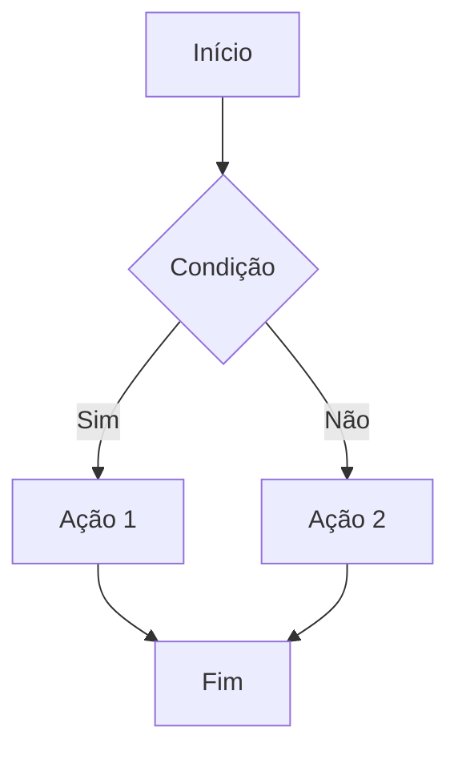

# Comando de Documentação

O comando `docs` do Fast Craftsmanship permite configurar, gerenciar e implantar documentação usando o [MkDocs](https://www.mkdocs.org/) com [Material for MkDocs](https://squidfunk.github.io/mkdocs-material/) de forma interativa.

## Subcomandos

### setup

Configura o MkDocs interativamente, permitindo personalizar o tema, plugins, extensões e criar um workflow de GitHub Actions para deploy automático.

```bash
fcship docs setup [OPÇÕES]
```

#### Argumentos

| Argumento | Descrição |
|-----------|-----------|
| `--force-overwrite` | Sobrescreve configurações existentes sem perguntar |
| `--site-name TEXT` | Define o nome do site de documentação |
| `--site-description TEXT` | Define a descrição breve do site |
| `--site-url TEXT` | Define a URL do site publicado |
| `--repo-url TEXT` | Define a URL do repositório GitHub |
| `--theme [material\|mkdocs\|readthedocs]` | Define o tema a ser usado |
| `--add-mermaid / --no-mermaid` | Ativa/desativa suporte para diagramas Mermaid |
| `--add-mkdocstrings / --no-mkdocstrings` | Ativa/desativa plugin mkdocstrings para documentação de API |
| `--setup-github-workflow / --no-github-workflow` | Ativa/desativa configuração do workflow de GitHub Actions |

#### Exemplos

Configuração interativa básica:
```bash
fcship docs setup
```

Configuração não-interativa com valores predefinidos:
```bash
fcship docs setup --force-overwrite --site-name "Meu Projeto" --site-description "Documentação do meu projeto" --theme material
```

Configuração com URL do GitHub e workflow de deploy:
```bash
fcship docs setup --repo-url "https://github.com/seu-usuario/seu-projeto" --setup-github-workflow
```

Este comando irá:

1. Verificar se o MkDocs está instalado, e tentar instalá-lo se necessário
2. Configurar o arquivo `mkdocs.yml` com base nas suas preferências
3. Criar uma estrutura básica de diretórios para a documentação
4. Opcionalmente, configurar um workflow de GitHub Actions para implantação

Durante a execução, você poderá configurar:
- Informações básicas do projeto (nome, descrição, URLs)
- Tema e suas personalziações
- Plugins (incluindo mkdocstrings para documentação de API)
- Extensões Markdown
- Suporte a diagramas com Mermaid

### serve

Inicia o servidor de desenvolvimento do MkDocs para visualização em tempo real.

```bash
fcship docs serve [OPÇÕES]
```

#### Argumentos

| Argumento | Descrição |
|-----------|-----------|
| `--dev-addr TEXT` | Endereço e porta para o servidor (formato 'host:porta') |
| `--livereload / --no-livereload` | Ativa/desativa recarregamento automático ao editar arquivos |
| `--dirtyreload / --no-dirtyreload` | Ativa/desativa recarregamento mais rápido (pode ter inconsistências) |
| `--strict / --no-strict` | Trata/não trata avisos como erros |

#### Exemplos

Iniciar servidor padrão:
```bash
fcship docs serve
```

Especificar porta diferente:
```bash
fcship docs serve --dev-addr 127.0.0.1:8080
```

Iniciar sem recarregamento automático:
```bash
fcship docs serve --no-livereload
```

Usar modo estrito (avisos como erros):
```bash
fcship docs serve --strict
```

O servidor será iniciado em http://127.0.0.1:8000 por padrão e se atualizará automaticamente conforme você edita os arquivos de documentação.

### build

Constrói a documentação para implantação.

```bash
fcship docs build [OPÇÕES]
```

#### Argumentos

| Argumento | Descrição |
|-----------|-----------|
| `--clean / --no-clean` | Remove/não remove arquivos antigos antes da construção |
| `--strict / --no-strict` | Trata/não trata avisos como erros |
| `--site-dir TEXT` | Define diretório onde os arquivos estáticos serão gerados |
| `--config-file TEXT` | Caminho para um arquivo de configuração alternativo |
| `--verbose / --no-verbose` | Ativa/desativa mensagens detalhadas durante a construção |

#### Exemplos

Build padrão:
```bash
fcship docs build
```

Build em modo limpo e detalhado:
```bash
fcship docs build --clean --verbose
```

Build para diretório específico:
```bash
fcship docs build --site-dir public/docs
```

Usando arquivo de configuração alternativo:
```bash
fcship docs build --config-file mkdocs.prod.yml
```

Este comando gera a versão estática da documentação na pasta `site/`, pronta para ser implantada em um servidor web.

## Workflow de GitHub Actions

Quando você escolhe configurar o workflow do GitHub Actions durante o comando `setup`, um arquivo `.github/workflows/docs.yml` é criado. Este workflow:

1. É acionado quando há alterações em arquivos de documentação no branch `main`
2. Instala o MkDocs e todas as dependências necessárias
3. Constrói a documentação
4. Implanta automaticamente no GitHub Pages
5. Cria tags de versão para cada implantação bem-sucedida

## Recursos adicionais

### Suporte a Mermaid

O comando `setup` oferece a opção de adicionar suporte a diagramas Mermaid para visualizar:
- Diagramas de fluxo
- Diagramas de sequência
- Diagramas de classe
- Diagramas ER
- Diagramas Gantt
- E muito mais

Exemplo de uso do Mermaid:

````markdown

````

### Documentação de API com mkdocstrings

O plugin mkdocstrings permite gerar documentação a partir de docstrings Python. Exemplo de uso:

````markdown
```python
def example_function(param1: str, param2: int) -> bool:
    """Função de exemplo com docstring estilo Google.
    
    Args:
        param1: Primeiro parâmetro
        param2: Segundo parâmetro
        
    Returns:
        Um resultado booleano
    """
    return True
```

Referência na documentação:

```
::: modulo.submodulo.example_function
```
````

## Dicas

1. Mantenha suas docstrings atualizadas para que a documentação de API seja útil
2. Use diagramas Mermaid para explicar fluxos complexos
3. Organize sua documentação em seções lógicas
4. Aproveite os recursos do Material for MkDocs como abas, blocos de código, alertas, etc.
5. Configure a navegação adequadamente no `mkdocs.yml` para uma melhor experiência do usuário 