# Diagramas com Mermaid

O Fast Craftsmanship suporta a criação de diagramas diretamente na documentação usando a sintaxe [Mermaid](https://mermaid-js.github.io/mermaid/).

## O que é Mermaid?

Mermaid é uma ferramenta baseada em JavaScript que permite gerar diagramas e fluxogramas a partir de descrições em texto, similar à forma como o Markdown funciona para criar documentos formatados.

## Tipos de Diagramas Suportados

### Fluxogramas (Flowcharts)

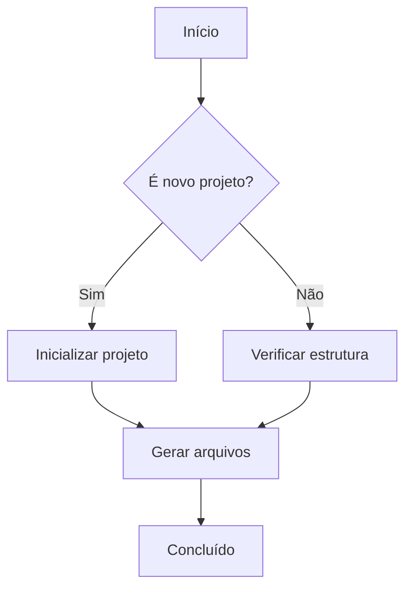

### Diagramas de Sequência

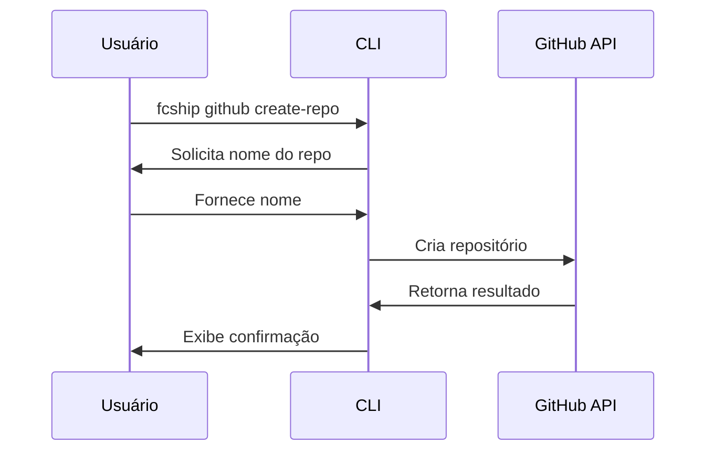

### Diagramas de Classe

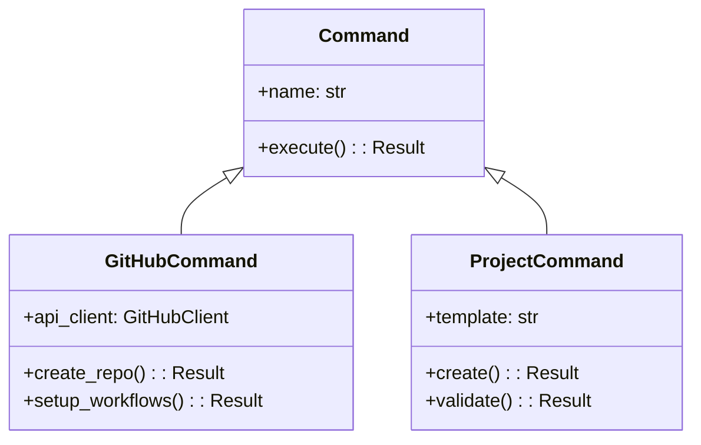

### Diagramas de Estado

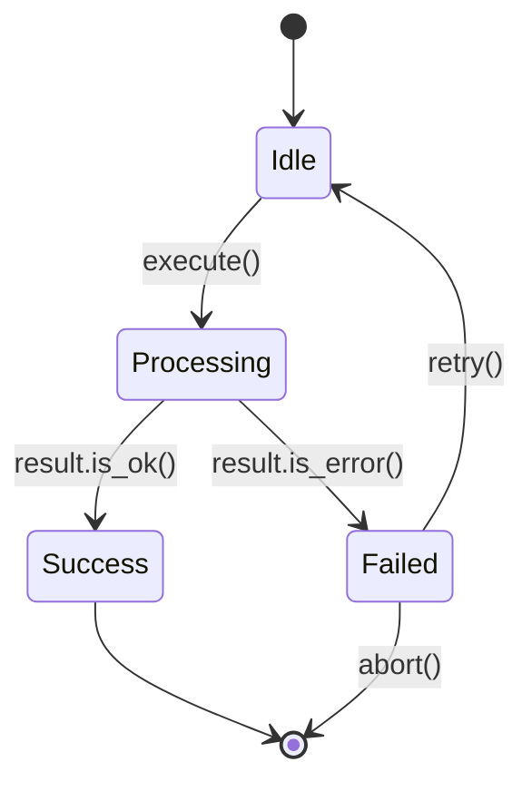

### Diagramas ER (Entidade-Relacionamento)

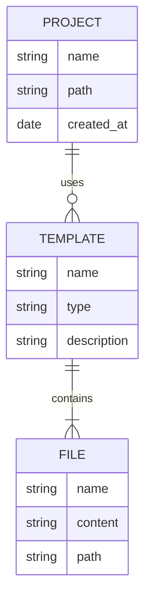

### Diagramas Gantt

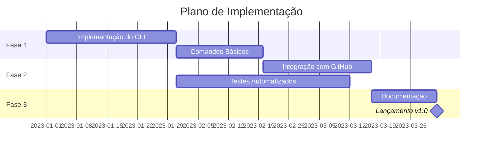

### Diagramas de Jornada do Usuário

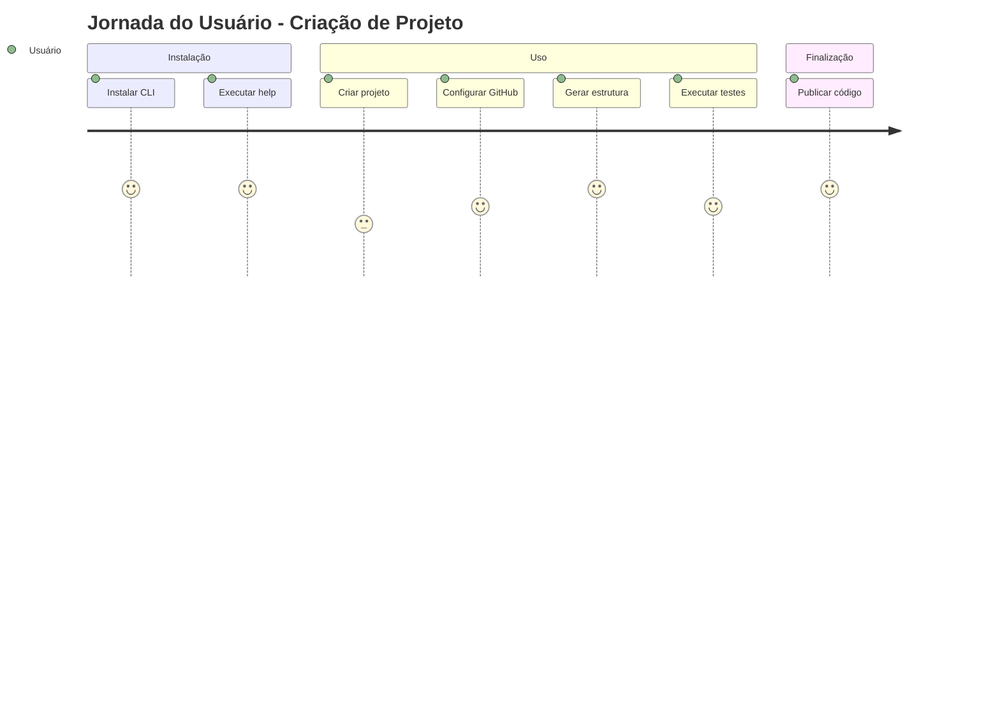

### Diagramas de Arquitetura C4 (com Integração Mermaid)

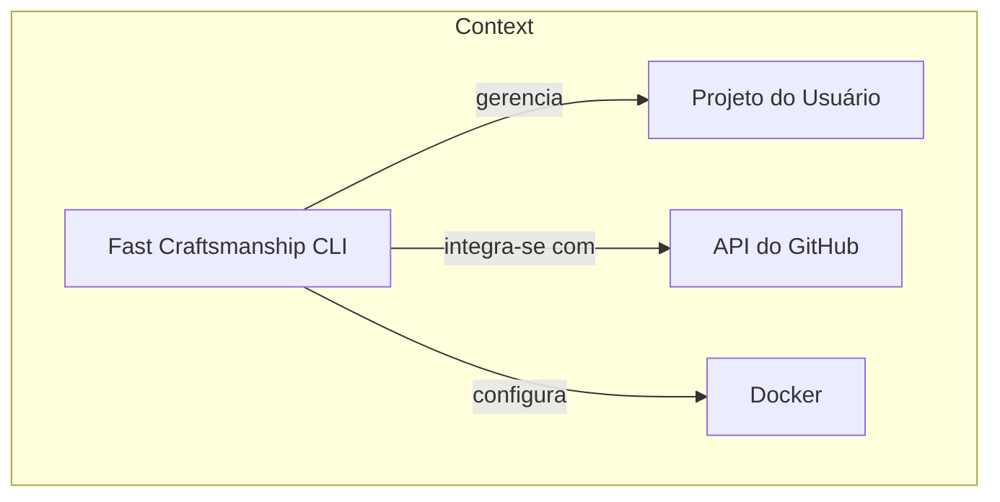

## Como Usar Diagramas na Documentação

Para adicionar um diagrama Mermaid à documentação, utilize a sintaxe de código com o tipo `mermaid`:

````markdown
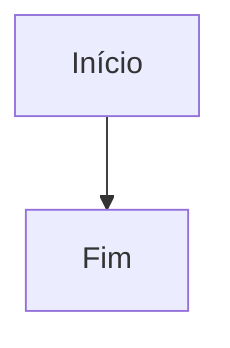
````

## Recomendações para Bons Diagramas

1. **Mantenha-os simples**: Diagramas devem ajudar a entender o conceito, não complicá-lo.
2. **Use cores com moderação**: Cores podem ajudar a destacar elementos importantes.
3. **Forneça legendas**: Explique o diagrama com texto antes ou depois dele.
4. **Consistência**: Mantenha um estilo consistente em todos os diagramas.
5. **Tamanho adequado**: Evite diagramas muito grandes que são difíceis de visualizar.

## Usando Diagramas para Documentar a Arquitetura do Fast Craftsmanship

Aqui está um exemplo de como usamos diagramas para documentar a arquitetura do Fast Craftsmanship:

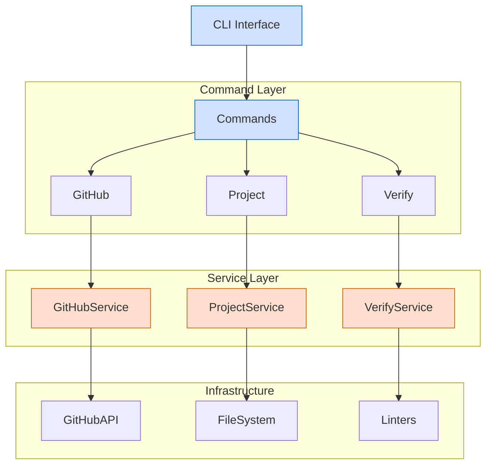

## Documentação Railway Oriented Programming com Mermaid

Este é um exemplo de como podemos documentar o fluxo do Railway Oriented Programming (ROP) usando Mermaid:

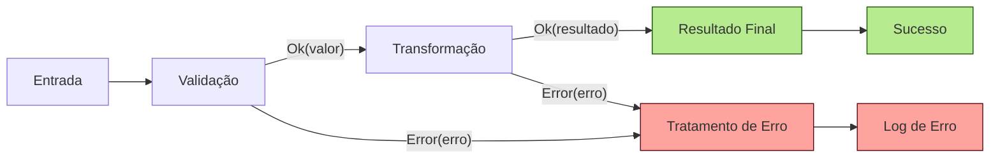

Para mais informações sobre a sintaxe Mermaid, consulte a [documentação oficial do Mermaid](https://mermaid-js.github.io/mermaid/). 