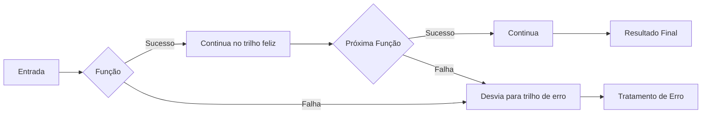
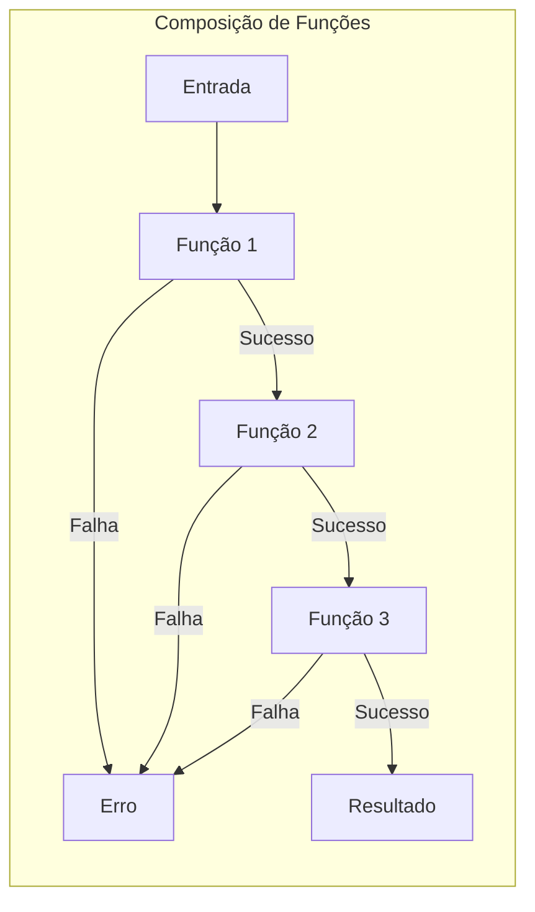
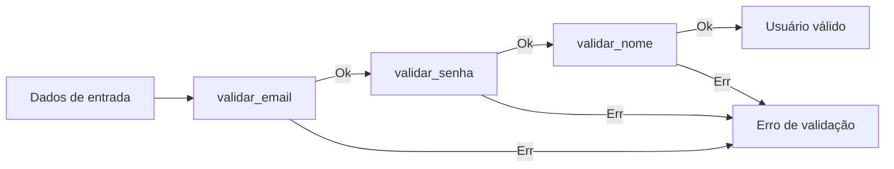
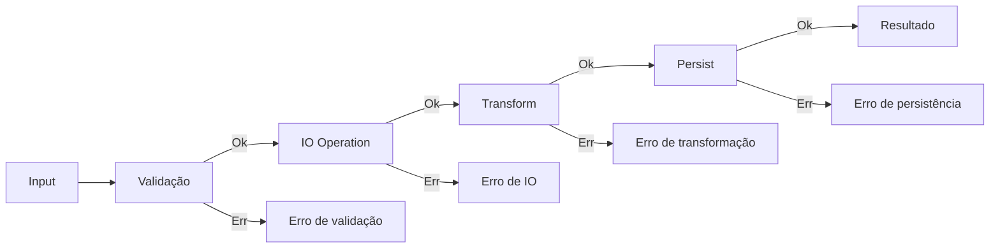
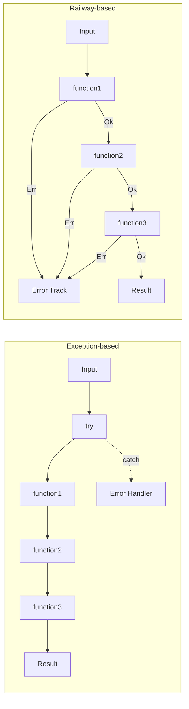

# Diagramas ROP

Esta página contém exemplos de diagramas para Railway Oriented Programming (ROP) usando Mermaid.

## Conceitos básicos de ROP

O Railway Oriented Programming é uma técnica para gerenciar fluxos de erro usando functores e mônadas. Os diagramas a seguir ilustram os conceitos principais.

### Fluxo básico de ROP



### Composição de Funções em ROP



## Implementação em Python

O diagrama a seguir mostra como implementar ROP em Python usando o módulo `expression`:

```mermaid
flowchart TD
    subgraph "ROP with Expression"
        A[Input] --> B[Ok | Err]
        B --> C{map / bind}
        C -->|Ok| D[Próxima função]
        C -->|Err| E[Mantém erro]
        D --> F[Ok | Err]
        E --> G[Err]
        F --> H{map / bind}
        G --> I[Fim do fluxo de erro]
        H -->|Ok| J[Próxima função]
        H -->|Err| I
    end
```

### Exemplo de pipeline de validação



## Manejo de efeitos

Exemplo de como ROP pode ser usado para gerenciar efeitos colaterais:



## Railway vs Exception

Comparação entre Railway Oriented Programming e manejo de exceções tradicional:



Estes diagramas ajudam a visualizar os conceitos de Railway Oriented Programming e como implementá-los em seu código. 